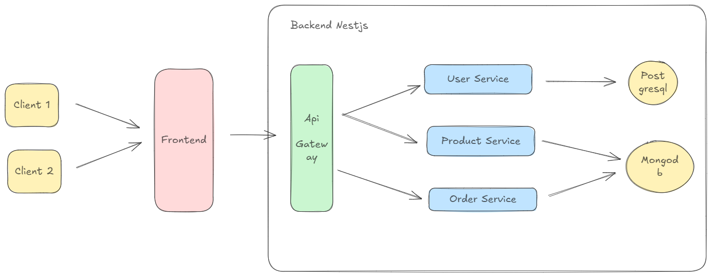

# 📦 E-commerce Microservices with NestJS

This project implements a microservice-based architecture for an e-commerce application using **NestJS**. The application is divided into multiple services that run on different ports, and each service has its own responsibility:

- **User Service**: Handles user management (registration, login, etc.)
- **Product Service**: Manages product data and product-related operations.
- **Order Service**: Handles order processing and order details.
- **Gateway Service**: The entry point for all requests, which orchestrates communication between the other services.

The services communicate with each other using **NestJS Microservices** (TCP transport) and **JWT for authentication**.

---

## 🚀 Features

- User registration, login, and authentication.
- Product management (add, update, delete, get details).
- Order management with multiple products.
- Microservices architecture with separate services for users, products, orders, and a gateway.
- JWT-based authentication and authorization.

---



---

## 🛠️ Prerequisites

Before running the project, ensure you have the following installed:

- [Node.js](https://nodejs.org/en/) (v14 or later)
- [NestJS CLI](https://docs.nestjs.com/) (Optional but recommended)
- [MongoDB](https://www.mongodb.com/) for database storage.

To install **NestJS CLI**, run the following command:

```bash
npm install -g @nestjs/cli
```

To run each microservice [users, products, orders, gateway]:

```bash
nest start gateway
nest start users
nest start products
nest start orders
```
